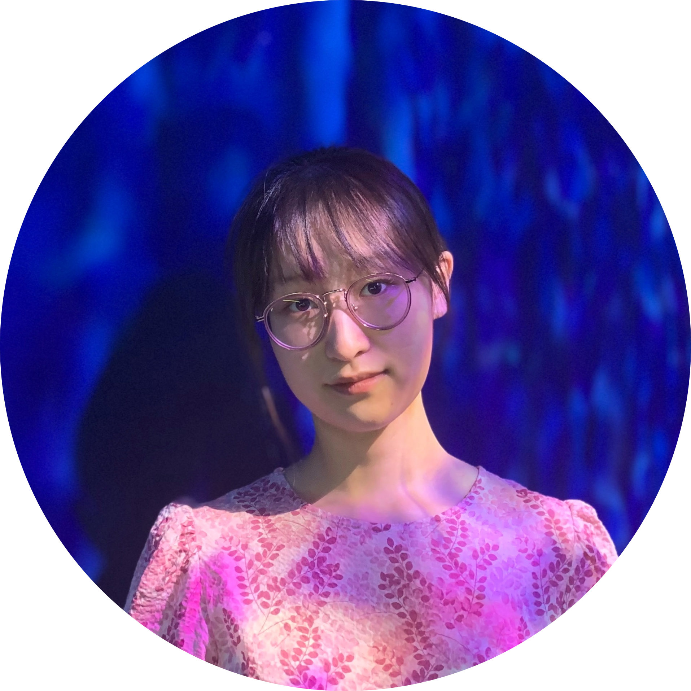

# Tianyu Chen

 *tic004@ucsd.edu*

## Introduction
I'm a third-year undergraduate student at the [University of California, San Diego](https://ucsd.edu/), majoring in Computer Science. Always growing, always learning, always curious, and always humble. Care about details and create for people.

## Interesting Stuff
Have some fun here! ~~Will or will not update in the future.~~

### Gallery
Take a look at my [Image Gallery](./gallery.md).

### Code Snippet
***Important!*** The **first** thing to print:
```
System.out.println("Hello, world!");
```

### Quote of the Day
From Albert Einstein:
>I love to travel, but hate to arrive.

## Plans

### Shopping List
- [x] Oat milk
- [x] Blueberry
- [] Matcha
- [] Vanilla ice cream

### To Drink and to Eat
- Milk Tea
  - Matcha
  - Green Tea
  - Jasmine
  - Black Tea
  - Black Sugar
- Fruits
  - Blueberry
  - Strawberry
  - Kiwi

### Classes to Take
- General Education (See [ERC Regional Specialization](https://roosevelt.ucsd.edu/academics/gen-ed/all-regions/americas-multi-ethnic-united-states.html) for substitutes)
  1. COGS 2
  2. CSE 194
- CSE Major
  1. CSE 120
  2. CSE 141 + 141L
  3. ...

Feeling boring seeing my plans? Jump back to the [Interesting Stuff](#interesting-stuff).